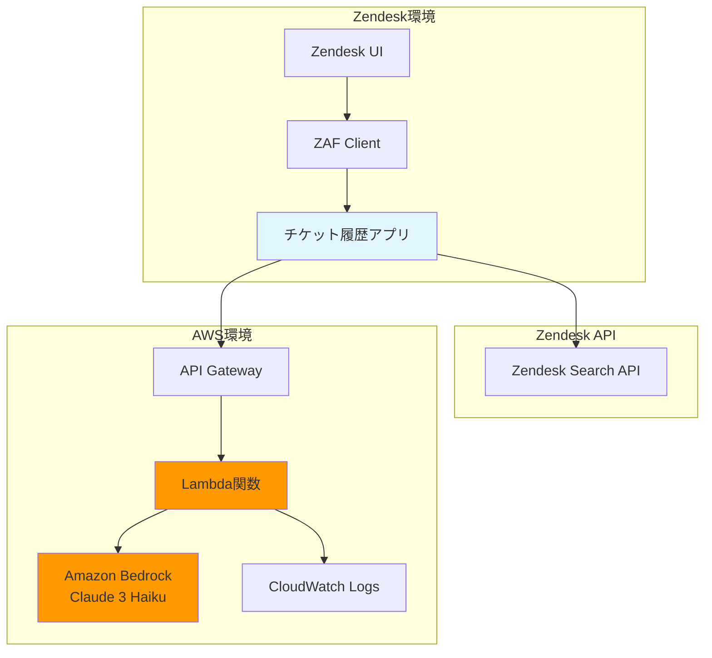

# 設計書

## 概要

Zendeskチケット履歴アプリケーションは、サポート担当者が現在のチケットの依頼者の過去のチケット履歴を確認し、AIによる要約を取得できるようにするシステムです。

本システムは以下の3つの主要コンポーネントで構成されます：

1. **フロントエンド**: Zendesk Apps Framework (ZAF) を使用したブラウザベースのアプリケーション
2. **バックエンドAPI**: AWS Lambda + API Gateway で構成されるサーバーレスAPI
3. **AI要約サービス**: Amazon Bedrock (Claude 3 Haiku) を使用した要約生成サービス

## アーキテクチャ



### データフロー

1. **チケット履歴取得フロー**:
   - サポート担当者がチケットを開く
   - ZAF Clientが依頼者のメールアドレスを取得
   - Zendesk Search APIで同じメールアドレスのチケットを検索
   - 結果をソートしてUI に表示

2. **AI要約生成フロー**:
   - サポート担当者が「要約する」ボタンをクリック
   - チケット情報をAPI Gatewayに送信
   - Lambda関数がBedrockにプロンプトを送信
   - Bedrockが要約を生成
   - 要約結果をUIに表示

## コンポーネントとインターフェース

### 1. フロントエンド (Zendesk App)

#### 1.1 ZAF Client初期化

```javascript
// ZAF Clientの初期化
const client = ZAFClient.init();
```

#### 1.2 依頼者情報取得

```javascript
/**
 * 現在のチケットの依頼者メールアドレスを取得
 * @returns {Promise<string>} 依頼者のメールアドレス
 * @throws {Error} 依頼者情報が存在しない場合
 */
async function getRequesterEmail() {
  const data = await client.get('ticket.requester');
  if (!data['ticket.requester'] || !data['ticket.requester'].email) {
    throw new Error('依頼者情報が見つかりません');
  }
  return data['ticket.requester'].email;
}
```

#### 1.3 チケット履歴取得

```javascript
/**
 * 指定されたメールアドレスの過去チケットを取得
 * @param {string} email - 依頼者のメールアドレス
 * @returns {Promise<Array>} チケット配列（降順ソート済み）
 */
async function fetchTicketHistory(email) {
  const currentTicketId = await getCurrentTicketId();
  const searchQuery = `type:ticket requester:${email}`;
  
  const response = await client.request({
    url: `/api/v2/search.json?query=${encodeURIComponent(searchQuery)}`,
    type: 'GET'
  });
  
  // 現在のチケットを除外
  const tickets = response.results.filter(ticket => ticket.id !== currentTicketId);
  
  // 作成日時の降順でソート
  tickets.sort((a, b) => new Date(b.created_at) - new Date(a.created_at));
  
  return tickets;
}
```

#### 1.4 チケット表示

```javascript
/**
 * チケット一覧をレンダリング
 * @param {Array} tickets - チケット配列
 */
function renderTicketList(tickets) {
  const container = document.getElementById('ticket-list');
  
  if (tickets.length === 0) {
    container.innerHTML = '<p>過去のチケットはありません</p>';
    return;
  }
  
  const html = tickets.map(ticket => {
    const subject = truncateSubject(ticket.subject, 100);
    const createdAt = formatDateTime(ticket.created_at);
    const status = translateStatus(ticket.status);
    
    return `
      <div class="ticket-item">
        <div class="ticket-subject">${escapeHtml(subject)}</div>
        <div class="ticket-meta">
          <span class="ticket-date">${createdAt}</span>
          <span class="ticket-status">${status}</span>
        </div>
      </div>
    `;
  }).join('');
  
  container.innerHTML = html;
}

/**
 * 件名を指定文字数で切り詰め
 * @param {string} subject - 件名
 * @param {number} maxLength - 最大文字数
 * @returns {string} 切り詰められた件名
 */
function truncateSubject(subject, maxLength) {
  if (subject.length <= maxLength) return subject;
  return subject.substring(0, maxLength) + '...';
}

/**
 * ISO 8601形式の日時を「YYYY-MM-DD HH:MM」形式に変換
 * @param {string} isoDateTime - ISO 8601形式の日時
 * @returns {string} フォーマット済み日時
 */
function formatDateTime(isoDateTime) {
  const date = new Date(isoDateTime);
  const year = date.getFullYear();
  const month = String(date.getMonth() + 1).padStart(2, '0');
  const day = String(date.getDate()).padStart(2, '0');
  const hours = String(date.getHours()).padStart(2, '0');
  const minutes = String(date.getMinutes()).padStart(2, '0');
  
  return `${year}-${month}-${day} ${hours}:${minutes}`;
}

/**
 * Zendeskステータスを日本語に変換
 * @param {string} status - Zendeskステータス
 * @returns {string} 日本語ステータス
 */
function translateStatus(status) {
  const statusMap = {
    'new': '新規',
    'open': '対応中',
    'pending': '保留中',
    'solved': '解決済み',
    'closed': 'クローズ'
  };
  return statusMap[status] || status;
}
```

#### 1.5 AI要約機能

```javascript
/**
 * AI要約を生成
 * @param {Array} tickets - チケット配列
 * @returns {Promise<string>} 要約テキスト
 */
async function generateSummary(tickets) {
  const summaryButton = document.getElementById('summary-button');
  const loadingIndicator = document.getElementById('loading');
  
  // ローディング表示
  loadingIndicator.style.display = 'block';
  summaryButton.disabled = true;
  
  try {
    const response = await fetch(API_ENDPOINT, {
      method: 'POST',
      headers: {
        'Content-Type': 'application/json',
        'x-api-key': API_KEY
      },
      body: JSON.stringify({ tickets })
    });
    
    if (!response.ok) {
      throw new Error(`API error: ${response.status}`);
    }
    
    const data = await response.json();
    return data.summary;
    
  } finally {
    // ローディング非表示
    loadingIndicator.style.display = 'none';
    summaryButton.disabled = false;
  }
}

/**
 * 要約結果を表示
 * @param {string} summary - 要約テキスト
 */
function displaySummary(summary) {
  const summaryArea = document.getElementById('summary-area');
  const summaryButton = document.getElementById('summary-button');
  
  summaryArea.textContent = summary;
  summaryArea.style.display = 'block';
  summaryArea.style.maxHeight = '300px';
  summaryArea.style.overflowY = 'auto';
  
  // ボタンテキストを変更
  summaryButton.textContent = '再要約する';
}
```

#### 1.6 キャッシング機能

```javascript
// メモリ内キャッシュ
const ticketCache = new Map();

/**
 * キャッシュを使用してチケット履歴を取得
 * @param {string} email - 依頼者のメールアドレス
 * @returns {Promise<Array>} チケット配列
 */
async function getTicketHistoryWithCache(email) {
  if (ticketCache.has(email)) {
    console.log('キャッシュからチケット履歴を取得');
    return ticketCache.get(email);
  }
  
  const tickets = await fetchTicketHistory(email);
  ticketCache.set(email, tickets);
  return tickets;
}

/**
 * セッション終了時にキャッシュをクリア
 */
function clearCacheOnSessionEnd() {
  window.addEventListener('beforeunload', () => {
    ticketCache.clear();
  });
}
```

#### 1.7 エラーハンドリング

```javascript
/**
 * エラーメッセージを表示
 * @param {string} message - エラーメッセージ
 * @param {Error} error - エラーオブジェクト
 */
function showError(message, error) {
  const errorContainer = document.getElementById('error-message');
  errorContainer.textContent = message;
  errorContainer.style.color = 'red';
  errorContainer.style.display = 'block';
  
  // エラー詳細をコンソールに出力
  console.error('エラー詳細:', error);
}
```

### 2. バックエンド (AWS Lambda)

#### 2.1 Lambda関数構造

```javascript
// Lambda handler
exports.handler = async (event) => {
  const startTime = Date.now();
  
  try {
    // リクエストボディの解析
    const body = JSON.parse(event.body);
    const { tickets } = body;
    
    if (!tickets || !Array.isArray(tickets)) {
      return {
        statusCode: 400,
        headers: getCorsHeaders(),
        body: JSON.stringify({ error: '不正なリクエスト形式' })
      };
    }
    
    // プロンプト構築
    const prompt = buildPrompt(tickets);
    
    // Bedrock呼び出し
    const summary = await invokeBedrock(prompt);
    
    // アクセスログ記録
    logAccess(event, 200, Date.now() - startTime);
    
    return {
      statusCode: 200,
      headers: getCorsHeaders(),
      body: JSON.stringify({ summary })
    };
    
  } catch (error) {
    console.error('エラー:', error);
    
    // アクセスログ記録
    logAccess(event, 500, Date.now() - startTime);
    
    return {
      statusCode: 500,
      headers: getCorsHeaders(),
      body: JSON.stringify({ error: 'AI要約の生成に失敗しました' })
    };
  }
};
```

#### 2.2 プロンプト構築

```javascript
/**
 * Bedrock用のプロンプトを構築
 * @param {Array} tickets - チケット配列
 * @returns {string} プロンプト
 */
function buildPrompt(tickets) {
  const ticketSummaries = tickets.map((ticket, index) => {
    return `
チケット${index + 1}:
- 件名: ${ticket.subject}
- 作成日: ${ticket.created_at}
- ステータス: ${ticket.status}
- 説明: ${ticket.description || '(なし)'}
`;
  }).join('\n');
  
  return `
以下は、ある顧客の過去の問い合わせチケット履歴です。
この履歴を分析して、以下の3つの観点から要約を作成してください：

1. 過去の問い合わせ履歴の要約
   - 主な問い合わせ内容のパターン
   - 頻繁に発生している問題

2. 注意点
   - この顧客に対応する際に気をつけるべきこと
   - 過去に発生した問題や懸念事項

3. 対応のヒント
   - 効果的な対応方法の提案
   - 過去の解決策で有効だったもの

${ticketSummaries}

上記の情報を基に、サポート担当者が効率的に対応できるよう、簡潔で実用的な要約を日本語で作成してください。
`;
}
```

#### 2.3 Bedrock API呼び出し

```javascript
const { BedrockRuntimeClient, InvokeModelCommand } = require('@aws-sdk/client-bedrock-runtime');

const bedrockClient = new BedrockRuntimeClient({
  region: process.env.BEDROCK_REGION || 'us-east-1'
});

/**
 * Bedrockを呼び出して要約を生成
 * @param {string} prompt - プロンプト
 * @returns {Promise<string>} 要約テキスト
 */
async function invokeBedrock(prompt) {
  const modelId = process.env.BEDROCK_MODEL_ID || 'anthropic.claude-3-haiku-20240307-v1:0';
  
  const payload = {
    anthropic_version: 'bedrock-2023-05-31',
    max_tokens: 2000,
    messages: [
      {
        role: 'user',
        content: prompt
      }
    ]
  };
  
  const command = new InvokeModelCommand({
    modelId: modelId,
    contentType: 'application/json',
    accept: 'application/json',
    body: JSON.stringify(payload)
  });
  
  const response = await bedrockClient.send(command);
  const responseBody = JSON.parse(new TextDecoder().decode(response.body));
  
  return responseBody.content[0].text;
}
```

#### 2.4 CORS設定

```javascript
/**
 * CORSヘッダーを取得
 * @returns {Object} CORSヘッダー
 */
function getCorsHeaders() {
  return {
    'Access-Control-Allow-Origin': '*.zendesk.com',
    'Access-Control-Allow-Headers': 'Content-Type,x-api-key',
    'Access-Control-Allow-Methods': 'POST,OPTIONS'
  };
}
```

#### 2.5 アクセスログ

```javascript
/**
 * アクセスログを記録
 * @param {Object} event - Lambdaイベント
 * @param {number} statusCode - HTTPステータスコード
 * @param {number} duration - 処理時間（ミリ秒）
 */
function logAccess(event, statusCode, duration) {
  const log = {
    timestamp: new Date().toISOString(),
    endpoint: event.path,
    method: event.httpMethod,
    statusCode: statusCode,
    duration: duration,
    requestId: event.requestContext.requestId
  };
  
  console.log('ACCESS_LOG:', JSON.stringify(log));
}
```

## データモデル

### チケットオブジェクト

```typescript
interface Ticket {
  id: number;                    // チケットID
  subject: string;               // 件名
  description: string;           // 説明
  status: string;                // ステータス (new, open, pending, solved, closed)
  created_at: string;            // 作成日時 (ISO 8601形式)
  updated_at: string;            // 更新日時 (ISO 8601形式)
  requester_id: number;          // 依頼者ID
}
```

### 依頼者オブジェクト

```typescript
interface Requester {
  id: number;                    // 依頼者ID
  name: string;                  // 名前
  email: string;                 // メールアドレス
}
```

### API リクエスト/レスポンス

#### 要約生成リクエスト

```typescript
interface SummaryRequest {
  tickets: Ticket[];             // チケット配列
}
```

#### 要約生成レスポンス

```typescript
interface SummaryResponse {
  summary: string;               // 要約テキスト
}
```

#### エラーレスポンス

```typescript
interface ErrorResponse {
  error: string;                 // エラーメッセージ
}
```

## 正確性プロパティ

*プロパティとは、システムのすべての有効な実行において真であるべき特性や動作のことです。これは、人間が読める仕様と機械で検証可能な正確性保証の橋渡しとなる形式的な記述です。*

### プロパティ1: メールアドレスの取得と保持

*任意の*チケットに対して、ZAF APIから依頼者情報を取得したとき、メールアドレスが正しく抽出され保持されること

**検証: 要件 1.1, 1.3**

### プロパティ2: チケット検索APIの呼び出し

*任意の*メールアドレスに対して、Zendesk Search APIを呼び出したとき、そのメールアドレスを持つすべてのチケットが返されること

**検証: 要件 2.1**

### プロパティ3: チケットの降順ソート

*任意の*チケット配列に対して、作成日時でソートしたとき、結果が降順（新しい順）になっていること

**検証: 要件 2.2**

### プロパティ4: チケット表示内容の完全性

*任意の*チケットに対して、表示用にレンダリングしたとき、件名（最大100文字）、作成日時（YYYY-MM-DD HH:MM形式）、ステータス（日本語）が含まれること

**検証: 要件 2.3, 2.4, 3.2, 3.3**

### プロパティ5: 現在のチケットの除外

*任意の*チケット配列と現在のチケットIDに対して、フィルタリングしたとき、現在のチケットが結果に含まれないこと

**検証: 要件 2.5**

### プロパティ6: Bedrock APIリクエストの構築

*任意の*チケット配列に対して、Bedrock用のプロンプトを構築したとき、「過去の問い合わせ履歴の要約」「注意点」「対応のヒント」の生成指示が含まれること

**検証: 要件 5.2, 5.3**

### プロパティ7: AI要約の表示とUI状態遷移

*任意の*要約テキストに対して、要約を表示したとき、専用エリアに表示され、ローディングインジケーターが非表示になり、ボタンテキストが「再要約する」に変更されること

**検証: 要件 5.4, 6.1, 6.3, 6.4**

### プロパティ8: エラーログの出力

*任意の*エラーに対して、エラーが発生したとき、エラー詳細がコンソールログに出力されること

**検証: 要件 7.5**

### プロパティ9: チケット情報のキャッシング

*任意の*メールアドレスに対して、同じメールアドレスで2回チケット履歴を要求したとき、2回目はZendesk APIを呼び出さずにキャッシュから取得すること

**検証: 要件 8.3**

### プロパティ10: アクセスログの記録

*任意の*API呼び出しに対して、Lambda関数が実行されたとき、タイムスタンプ、エンドポイント、ステータスコードを含むアクセスログがCloudWatch Logsに記録されること

**検証: 要件 10.4**

## エラーハンドリング

### フロントエンドエラー

1. **依頼者情報取得エラー**
   - 原因: ZAF APIエラー、依頼者情報が存在しない
   - 処理: エラーメッセージを赤色で表示、コンソールにエラー詳細を出力
   - メッセージ: 「依頼者情報の取得に失敗しました」

2. **チケット履歴取得エラー**
   - 原因: Zendesk Search APIエラー、ネットワークタイムアウト
   - 処理: エラーメッセージを赤色で表示、コンソールにエラー詳細を出力
   - メッセージ: 「チケット履歴の取得に失敗しました」

3. **AI要約生成エラー**
   - 原因: API Gatewayエラー、Lambda関数エラー、Bedrock APIエラー、ネットワークタイムアウト
   - 処理: エラーメッセージを赤色で表示、コンソールにエラー詳細を出力、ローディングインジケーターを非表示
   - メッセージ: 「AI要約の生成に失敗しました」

### バックエンドエラー

1. **不正なリクエスト形式**
   - 原因: リクエストボディが不正、ticketsフィールドが存在しない
   - 処理: HTTPステータス400を返却、エラーメッセージを返却
   - メッセージ: 「不正なリクエスト形式」

2. **Bedrock API エラー**
   - 原因: Bedrockサービスエラー、認証エラー、レート制限
   - 処理: HTTPステータス500を返却、エラーメッセージを返却、エラーログを出力
   - メッセージ: 「AI要約の生成に失敗しました」

3. **タイムアウトエラー**
   - 原因: Bedrock APIの応答が遅い
   - 処理: HTTPステータス500を返却、エラーメッセージを返却、エラーログを出力
   - メッセージ: 「AI要約の生成に失敗しました」

## テスト戦略

### デュアルテストアプローチ

本システムでは、ユニットテストとプロパティベーステストの両方を使用して包括的なテストカバレッジを実現します。

- **ユニットテスト**: 特定の例、エッジケース、エラー条件を検証
- **プロパティベーステスト**: すべての入力に対する普遍的なプロパティを検証

### プロパティベーステスト

プロパティベーステストには、JavaScriptの**fast-check**ライブラリを使用します。

#### 設定

- 各プロパティテストは最低100回の反復を実行
- 各テストには設計書のプロパティ番号を参照するタグを付与
- タグ形式: `Feature: zendesk-ticket-history-app, Property {番号}: {プロパティテキスト}`

#### テスト対象プロパティ

1. メールアドレスの取得と保持（プロパティ1）
2. チケット検索APIの呼び出し（プロパティ2）
3. チケットの降順ソート（プロパティ3）
4. チケット表示内容の完全性（プロパティ4）
5. 現在のチケットの除外（プロパティ5）
6. Bedrock APIリクエストの構築（プロパティ6）
7. AI要約の表示とUI状態遷移（プロパティ7）
8. エラーログの出力（プロパティ8）
9. チケット情報のキャッシング（プロパティ9）
10. アクセスログの記録（プロパティ10）

### ユニットテスト

ユニットテストには、**Jest**を使用します。

#### テスト対象

1. **エッジケース**:
   - 依頼者情報が存在しない場合のエラー処理
   - 過去のチケットが存在しない場合のメッセージ表示
   - チケットが存在しない場合のボタン無効化
   - 空のチケット配列の処理

2. **エラー条件**:
   - Zendesk APIエラー時の処理
   - Bedrock APIエラー時の処理
   - ネットワークタイムアウト時の処理
   - 不正なリクエスト形式の処理

3. **統合ポイント**:
   - ZAF Clientとの統合
   - API Gatewayとの統合
   - Bedrockとの統合

4. **UI動作**:
   - ローディングインジケーターの表示/非表示
   - ボタンテキストの変更
   - エラーメッセージの色
   - スクロール可能な表示エリアの設定

### テストバランス

- プロパティベーステストは、ランダム化により多数の入力をカバー
- ユニットテストは、特定の例とエッジケースに焦点を当てる
- 両方のアプローチを組み合わせることで、包括的なカバレッジを実現
- プロパティベーステストで一般的な正確性を検証し、ユニットテストで具体的なバグを捕捉
